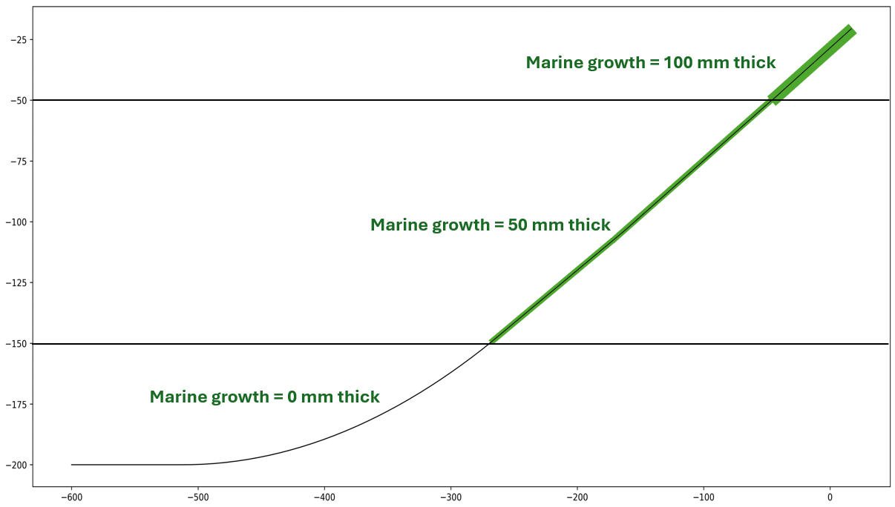

# Moorings, Sections, and Connectors

## Overview

This document describes the three core classes for modeling mooring systems in FAModel:

- **Mooring**: An Edge class representing a complete mooring line from anchor to fairlead (or fairlead to fairlead for shared moorings)
- **Section**: An Edge subcomponent representing a continuous segment of line with uniform material properties
- **Connector**: A Node subcomponent representing connection points (shackles, swivels, etc.) between sections or at line ends

### Mooring Line Structure

A typical mooring line is composed of alternating Section and Connector objects, ordered from end A (anchor) to end B (fairlead). 
A mooring line must always start and end with a connector. For example:

```
Chain-Polyester-Chain mooring:
  [Connector] → [Chain Section] → [Connector] → [Polyester Section] → [Connector] → [Chain Section] → [Connector]
  (anchor end, A)                                                     (fairlead end, B)
```

This structure allows flexible modeling of complex mooring configurations, including:
- **Bridles and parallel sections**: Parallel sections along or at the ends of a line
- **Shared moorings**: Lines connecting two fairleads (both ends floating)
- **Mixed-material lines**: Different sections of the line containing different materials

## Documentation Layout

* [The Mooring Class](#the-mooring-class)
	* [Mooring Properties](#mooring-properties)
	* [Mooring Methods](#mooring-methods)
* [The Section Class](#the-section-class)
* [The Connector Class](#the-connector-class)
* [Marine Growth Modeling](#marine-growth-modeling)
	* [Marine Growth Modeling Methodology](#marine-growth-modeling-methodology)
	* [Marine Growth Calculations](#marine-growth-calculations)
	* [Marine Growth Input](#marine-growth-input)


## The Mooring Class

The Mooring class provides a data structure for design information of a mooring line. Design information 
includes a design dictionary with the following details:
- zAnchor  : Anchor depth
- rad_fair : Fairlead radius
- z_fair   : Fairlead depth 
- span     : 2D distance from fairlead to anchor (or fairlead to fairlead)
- Subcomponents: List of line sections and connectors in order from end A to end B
    The values in each subcomponent type vary depending on if it is a section or connector. For sections:
		- type : material property dictionary
			- d_nom, d_vol : diameter (nominal and volume-equivalent) [m]
			- material
			- cost [USD]
			- m : linear mass [g/m]
			- w : weight [N/m]
			- MBL : minimum breaking load [N]
			- EA : stiffness coefficient [N]
		- L : Line section length [m]
	For connectors:
	    - m : mass [kg]
		- v : volume [kg/m^3]
		- CdA 
	
The Mooring object contains subcomponent objects that represent each component of the full mooring line. Line segments (lengths of a mooring line with one material) are Section objects, while connectors between segments and at the ends of the lines are Connector objects. These components alternate, and are listed in the subcomponents section of the design dictionary in order from end A to end B. If there are parallel sections, such as in the case of a bridle, the parallel sections are described with nested lists.

## Mooring Properties

Mooring properties are organized by functional category:

### Geometric Properties
- `rA` - End A absolute coordinates (anchor, or fairlead if shared mooring) [x, y, z]
- `rB` - End B absolute coordinates (fairlead) [x, y, z]
- `rel_heading` - line heading relative to platform heading
- `heading` - Compass heading from end B to end A [radians]
- `span` - 2D (x-y) horizontal distance from fairlead to anchor or between fairleads [m]
- `rad_anch` - Anchoring radius (distance from anchor center) [m]
- `rad_fair` - Fairlead radius (distance from platform center) [m]
- `z_anch` - Anchoring depth [m]
- `z_fair` - Fairlead depth below water surface [m]

### Design Properties
- `dd` - Design description dictionary containing all line component specifications (see [above](#the-mooring-class) for a full description of the dd)
- `lineProps` - Line property sizing function coefficients
- `n_sec` - Number of distinct sections in the mooring
- `i_sec` - Indices of Section objects in subcomponents list
- `i_con` - Indices of Connector objects in subcomponents list
- `parallels` - Boolean indicating if bridle or other parallel sections exist
- `shared` - Line type: 0 = anchored regular line, 1 = shared line connecting two fairleads, 2 = half of symmetric shared line
- `symmetric` - Boolean for symmetric shared line configuration
- `adjuster` - Custom function to adjust mooring positioning (optional)

### Analysis & State Properties
- `ss` - MoorPy subsystem object representing this mooring for quasi-static analysis
- `loads` - Dictionary of forces/tensions at different locations and conditions
- `safety_factors` - Dictionary of safety factor values (SF = MBL / Actual Load)
- `envelopes` - 2D motion envelopes and clearance buffers from watch circle analysis
- `applied_states` - Dictionary tracking applied modifications (marine growth, creep, corrosion)
- `cost` - Dictionary of line costs (material + installation)
- `failure_probability` - Dictionary of failure probability estimates
- `reliability` - Dictionary of reliability metrics
- `env_impact` - Environmental impact factors (e.g., disturbed seabed area)

### Physical Properties
- `rho` - Water density [kg/m³]
- `g` - Gravitational acceleration [m/s²]


## Mooring Methods

### Design & Component Management

#### sections()
Returns a list of Section objects in the mooring in order from end A to end B.

#### connectors()
Returns a list of Connector objects in the mooring in order from end A to end B.

#### fairleads()
Returns a list of Fairlead objects attached to the mooring connectors at specified end (A or B).

#### update()
Update the Mooring object based on the current state of the design dictionary, or specify a new design dictionary to replace the current design.

#### reset()
Reset the mooring to initial state by clearing the MoorPy subsystem and applied_states tracking.

#### setSectionLength()
Update the length of a specific section, including synchronized update in MoorPy subsystem if it exists.

#### setSectionType()
Change the material/diameter of a section by specifying a new line type, synchronized to MoorPy subsystem.

#### adjustSectionType()
Adjust a section's properties by specifying a new diameter and/or material. Automatically looks up the resulting line type from available line properties.

#### addSection()
Convenience method to add a new section to the design.

#### addConnector()
Convenience method to add a connector to the design.

#### convertSubcomponents()
Convert raw subcomponent dictionaries into full Section and Connector objects with all properties initialized.

### Positioning & Geometry

#### reposition()
Update mooring position and geometry after platform relocation or heading change. If an `adjuster` function is provided, the mooring design can be adjusted to the new depth. Otherwise updates end positions based on current attachment geometry.
Called automatically when connected platform's setPosition() method called, or you can call it separately to manually adjust endpoints/headings.

#### setEndPosition()
Manually set the xyz coordinates of a mooring end (A or B). This is automatically called by reposition().

#### positionSubcomponents()
Calculate and apply approximate xyz positions relative to the mooring endpoints for all Section and Connector subcomponents based on section lengths.

### MoorPy Subsystem Integration

#### createSubsystem()
Create a MoorPy subsystem object representing this mooring for quasi-static analysis. If mooring.parallels=True, it will create a series of connected Moorpy line and point objects instead of a subsystem so that parallel sections can be accurately represented.
Called automatically in project.getMoorPyArray(), or you can call it separately to create a subsystem based on the current mooring design.


### Analysis & Loads

#### updateTensions()
Retrieve line tensions from MoorPy subsystem and update the `loads` dictionary for each Section. Only updates if new tensions exceed previously recorded maximum.

#### updateSafetyFactors()
Calculate and update safety factors for all sections. Supports different factor types and load conditions.

#### getEnvelope()
Compute the allowable motion envelope for the mooring based on watch circle analysis of attached platforms. Automatically calls watch circle methods if not already computed.
Returns motion envelope stored in `envelopes` property.

### Environmental Effects & Modifications

#### addMarineGrowth()
Apply marine growth thickness to the mooring line subsystem based on depth ranges. Updates line diameter, mass, weight, and drag coefficient accordingly. Iteratively refines depth-based thickness transitions for accuracy.
See [Marine Growth Input](#marine-growth-input) for input dictionary setup
See [Marine Growth Modeling](#marine-growth-modeling) for detailed methodology.

#### setCreep()
Elongate line sections that have a `creep_rate` parameter (e.g., polyester ropes)

#### setCorrosion()
Reduce the minimum breaking load (MBL) of line sections with corrosion rate parameter.

#### adjustPropertySets()
Switch line type properties to an alternative set defined in the line property (MoorProps) yaml.

#### updateState()
Apply a state modification dictionary (stateDict) and update the mooring system accordingly. Automatically tracks applied states.
 - stateDict typical inputs:
    - 'years': Global number of years for creep and corrosion (integer).
    - 'stiffnessBounds': Dictionary with 'lower' (boolean) for stiffness bounds.
    - 'creep': Boolean indicating whether to apply creep.
    - 'corrosion': Boolean indicating whether to apply corrosion.
    - 'marineGrowth': Dictionary for marine growth configuration (same as addMarineGrowth).

#### mirror()
Mirror a half-design (for shared symmetric moorings) to create a full line configuration. Assumes line symmetry about centerpoint.

### Cost Analysis

#### getCost()
Calculate total mooring cost based on MoorPy subsystem estimates. Returns sum of all individual costs in the cost dictionary.
## The Connector Class

The Connector class extends the Node base class to represent a mooring line connector element (shackles, swivels, h links, etc.).

**Parent Classes**: Node, dict

### Connector Properties

- `id` - Unique identifier for the connector
- `r` - XYZ position coordinates [m]
- `m` - Mass of connector component [kg]
- `v` - Displaced volume [m³]
- `CdA` - Hydrodynamic drag coefficient × projected area product
- `mpConn` - Associated MoorPy Connector object (if MoorPy subsystem exists)
- `loads` - loads dictionary
- `failure_probability` - dictionary of failure probabilities
- `cost` - cost dictionary

### Connector Methods

#### makeMoorPyConnector()
Create or update a MoorPy Connector object in a MoorPy system. Automatically applies mass, volume, and CdA properties if available.
Called automatically from mooring.createSubsystem() to include a point with connector drag and inertial properties in quasi-static analysis.

#### getProps()
Wrapper function to get moorpy point props dictionary and set the point type in the moorpy system
(if it exists)

#### getCost()
Get cost of the connector from MoorPy pointProps.
Wrapper for moorpy's getCost_and_MBL helper function

---

## The Section Class

The Section class extends the Edge base class to represent a mooring line segment with uniform material properties and length.

**Parent Classes**: Edge, dict

### Section Properties

- `type` - Material property dictionary
- `L` - Section length [m]
- `mpLine` - Associated MoorPy Line object (if MoorPy subsystem exists)
- `loads` - Dictionary tracking forces/tensions in this section
- `safety_factors` - Dictionary tracking SF = MBL / Actual Load for different conditions

### Section Methods

#### makeMoorPyLine()
Create a MoorPy Line object in a MoorPy system.
If this section is attached to connectors that already have associated
MoorPy point objects, then those attachments will also be made in MoorPy.
Called automatically by mooring.createSubsystem() when building a MoorPy subsystem to include this section in quasi-static analysis.

---

## Marine Growth Modeling

### Overview

Marine growth (biofouling) is the accumulation of biological organisms (algae, barnacles, mussels, etc.) on submerged surfaces. On mooring lines, marine growth significantly increases:
- Line diameter 
- Submerged weight 
- Hydrodynamic drag

These effects can substantially increase mooring tensions and affect system stationkeeping. FAModel models marine growth according to **DNVGL OS-E301 (2018)** and **DNV-RP-C205** standards.

### Marine Growth Modeling Methodology

Generally, marine growth levels will vary with depth. To capture this phenomena, we support the application of marine growth thicknesses and densities that vary by depth range along the mooring line.


**Depth-Based Thickness Distribution:**
The user can define depth ranges and the marine growth thickness and density associated with that range along the mooring line.
The `addMarineGrowth()` method analyzes the mooring node points to identify depth ranges of the line, then automatically divides the line into segments matching the marine growth thickness transitions. For example, if we have a site with 100 mm of marine growth thickness
at or above 50 m depth, 50 mm thickness from 50-100 m depth, and no marine growth below 100 m depth, a uniform catenary chain mooring line would be split into 3 sections with different properties:

```
Original line (1 segment):  [Chain]

After applying marine growth (3 segments):
  [0-50m]:    Chain + 100mm growth
  [50-100m]:  Chain + 50mm growth  
  [>100m]:    Chain (pristine)
```
See the example image showing a mooring line with three distinct zones of marine growth:


**Iterative Refinement:**
Since marine growth adds weight, the line sags deeper, potentially shifting the depth at which growth thickness changes. The algorithm iteratively recalculates segment boundaries until convergence:
1. Apply initial marine growth thickness to segments
2. Solve line equilibrium with new weights
3. Check if transition depths changed
4. If changed, adjust and repeat
5. Stop when transition depths stabilize within tolerance

**Current Limitations:**
- Not currently modeled on connectors
- Not currently modeled on platform surfaces
- See [Cables README](../cables/README.md) for marine growth on dynamic cables with buoyancy

### Marine Growth Calculations

The mass per unit length of marine growth on a line is calculated with the following formula:
```math
M_{growth} = \frac{\pi}{4}\left[(D_{nom}+2\Delta T_{growth})^2-D_{nom}^2\right]\rho_{growth}\mu
```
Where $\rho_{growth}$ is the density of marine growth, $D_{nom}$ is the nominal diameter of the pristine line, $\Delta T_{growth}$ is the thickness of the marine growth layer, and $\mu$ can be taken as 2.0 for chains or 1.0 for wire ropes. In the absence of further information, 1.0 is used for all rope materials such as polyester, and all cables.

Similarly, the submerged weight per unit length of the marine growth can be determined with the following formula:
```math
W_{growth} = M_{growth}\left[1-\frac{\rho_{seawater}}{\rho_{growth}}\right]g
```
Where $M_{growth}$ is the mass of marine growth on the line, $\rho_{seawater}$ is the density of the liquid the line is submerged in, and $g$ is the acceleration due to gravity.

>[!NOTE]
>The calculation for marine growth on cable sections with buoyancy modules requires a different approach. See the Marine Growth on Dynamic Cables section in the [Cables ReadMe](../cables/README.md) for more information.

The formula for calculation of marine growth in the DNVGL OS-E301 standard is as follows:
```math
C_{D_{growth}} = C_D \left[\frac{D_{nom}+2\Delta T_{growth}}{D_{nom}}\right]
```
Where $C_D$ is the drag coefficient for the pristine line. This formula assumes the drag coefficient is relative to the nominal diameter, as shown by the use of $D_{nom}$ in the formula. Drag coefficients in MoorDyn are based on the volume equivalent diameter, $D_{ve}$, requiring that a conversion factor between $D_{ve}$ and $D_{nom}$ be added to this equation. However, the ratio between $D_{ve}$ and $D_{nom}$ is altered by the addition of marine growth, so the conversion factor must be re-determined based on the new ratio between $D_{ve}$ and $D_{nom}$.

The new $D_{ve}$ can be determined by first calculating the air and submerged weights per unit length of the line with marine growth, and then using the difference in these values to find the weight per unit length of the water displaced by the line. From there, we can then determine the volume per unit length (area) of the line and subsequently the volume-equivalent diameter, as shown in the equations below:
```math
W_{seawater} = M_{pristine}g + M_{growth}g - (W_{pristine}+W_{growth})
```
```math
A=\frac{W_{seawater}}{\rho_{seawater}g}
```
```math
D_{ve} = \sqrt{\frac{4A}{\pi}}
```
Once $D_{ve}$ has been determined, the new volumetric-equivalent drag coefficient can be calculated with the following formula:
```math
C_{D_{growth-ve}} = C_{D_{ve}}\left(\frac{D_{ve_{pristine}}}{D_{nom_{pristine}}}\right) \left(\frac{D_{nom_{growth}}}{D_{nom_{pristine}}}\right) \left(\frac{D_{nom_{pristine}}}{D_{ve_{growth}}}\right)
```
Where $C_{D_{ve}}$ is the volume equivalent drag coefficient for the pristine line, $D_{ve_{pristine}}$ is the volume-equivalent diameter for the pristine line, $D_{nom_{pristine}}$ is the nominal diameter for the pristine line, $D_{nom_{growth}}$ is the nominal diameter with marine growth, and $D_{ve_{growth}}$ is the volume-equivalent diameter with marine growth.

The first ratio in parentheses of the equation above is the conversion factor from $C_{D_{ve}}$ to $C_{D_{nom}}$. The second ratio is the same as the ratio in the equation provided by DNV, which serves to increase the drag coefficient based on the ratio of nominal diameters. The third ratio reconverts from the nominal to the volume equivalent diameter, and accounts for the use of the marine growth volume-equivalent diameter in MoorDyn’s calculation of drag force, as explained below. The calculation of the drag force can be determined using the equation below:
```math
F_D = \rho C_DA|v|v

```
Where A is the area of the line defined as $A=length*diameter$, $\rho$ is the density of fluid, and $v$ is the velocity of the fluid.

Since the drag force calculation depends on the diameter, DNVGL OS-E301_2018 specifies that the pristine nominal diameter should be used to determine the drag force in the area calculation, and only the drag coefficient should be changed to reflect the increase in drag from marine growth. However, MoorDyn utilizes the volume equivalent marine growth diameter for its calculations. To ensure that the resulting drag force will be equivalent, the drag coefficient entered into MoorDyn needs to use the pristine line nominal diameter in the numerator of the last ratio, rather than the marine growth nominal diameter. 

### Marine Growth Input

Marine growth is specified as a list of dictionaries, one per depth range. Can be provided directly to `mooring.addMarineGrowth()` or automatically pulled from the Project's `marine_growth` property.

**Dictionary Format:**
See an example marine growth input below:
```python
marine_growth = [
    {
        'thickness': 0.100,          # [m] - thickness added to nominal radius
        'lowerRange': 0.0,           # [m] - lower z-coordinate of this depth band
        'upperRange': 50.0,          # [m] - upper z-coordinate of this depth band
        'density': 1325              # [kg/m³] - marine growth density (optional, default 1325)
    },
    {
        'thickness': 0.050,
        'lowerRange': 50.0,
        'upperRange': 100.0,
        'density': 1325
    },
    {
        'thickness': 0.0,            # No growth below 100m
        'lowerRange': 100.0,
        'upperRange': 5000.0
    }
]
```

**Usage:**
```python
# Apply marine growth to a mooring
mooring = project.mooringList['Mooring_01']
mooring.addMarineGrowth(marine_growth)

# Or use project-level marine growth settings (useful for adding to all moorings & dynamic cables)
project.getMarineGrowth(lines='all')
```

**Special Cases:**
- **Dynamic cables with buoyancy**: See [Cables ReadMe](../cables/README.md) for different marine growth treatment (accounts for buoyancy modules)

